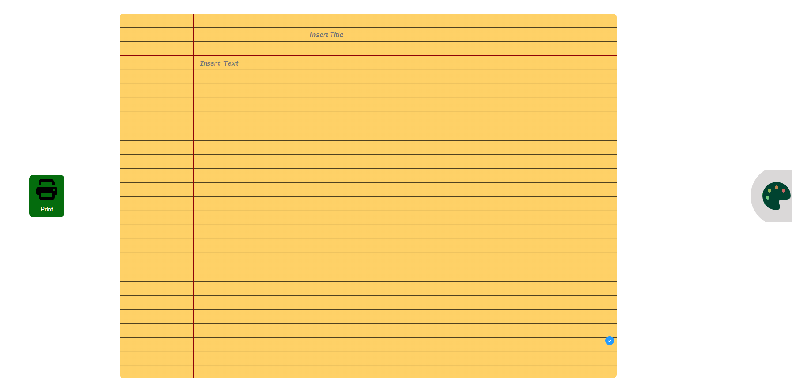

<h1 align="center">Notepad React Js</h1>

   Welcome, meet the process:

 

</img>
  <h3>
    <a href="http://notepaddevk.s3-website-us-east-1.amazonaws.com/">
      Preview Site
    </a>
  </h3>

 

## Table of contents

- [Description](#description)
  - [Design](#design)
- [Hints](#hints)
  - [Css](#css)
  - [Reactjs](#reactjs)
- [Autor](#autor)

## Description

Currently version (1.1v)

### Design

I was studying about data structure writing everything in my note pad so thought that might be a good idea if create some kind Word but with the design of a note pad, so i choose for my deign the yellow color because it looks good with that color :)

## Hints
I'm marking this section as hints because i would like to show what i've learned with this project and maybe someone with the same issues i can get its project completed and good designed.
### Css
-You can set a property as child from other using `&:hover` at the end of the father container and then both classes will get linked.
-You can set a line pattern using `background-image: repeating-linear-gradient()`, you just have to set the space between the lines and what color you would like to use 
-clip-path is a powerful property, you can design any figure using percentage for the figure points, you can use `polygon` to set a triangle figure or circle using `circle()`, ellipse and so on...
- Also, i used ` background: linear-gradient` to bring a custom shape as result you can see that the pallet icon has as background color a good looking gradient and hover to captive the attention of the user.
- I found a library which you can implement and use as screenshot of a div or any tag, so basically print any container you want.

### Reactjs

- Using react allowed me to understand how the props really works and how you can use it in order to pass any value.
- I tried to solve and issue related with a function not being passed i tried to solve it using `React.context` and `React.provider` but i fixed it lifting the state from a child component to its father, so in the future i will try to use `React.context` and `React.provider` if i see the same scenario. 

### Autor

- Github - [TkDevk](https://github.com/TkDevk)
